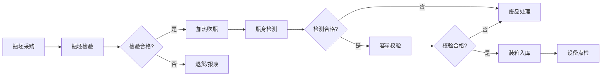

## 1. 产品概述

吹瓶厂PET瓶坯业务管理系统是面向吹瓶生产企业的全流程质量管理系统，覆盖瓶坯采购入库到成品装箱出库的完整生产链条。

- **核心目标**：实现瓶坯质量追溯、吹瓶过程管控、成品质量检测的数字化管理，提升生产效率与产品合格率
- **目标用户**：生产管理人员、质检人员、采购人员、设备维护人员
- **产品价值**：通过标准化的质检流程和数据采集，降低废品率，提高生产透明度

## 2. 核心功能

### 2.1 用户角色

| 角色 | 登录方式 | 核心权限 |
|------|----------|----------|
| 系统管理员 | 账号密码 | 全部模块管理、用户管理、系统配置 |
| 生产主管 | 账号密码 | 查看全部模块数据、生产调度 |
| 质检人员 | 账号密码 | 瓶坯检验、瓶身检测、容量校验操作 |
| 采购人员 | 账号密码 | 瓶坯采购、供应商管理 |
| 设备人员 | 账号密码 | 设备点检、模具保养记录 |

### 2.2 功能模块

1. **瓶坯采购**：瓶坯规格采购、供应商管理、采购订单管理
2. **瓶坯检验**：瓶坯重量抽检、透明度外观检查、来料检验记录
3. **加热吹瓶**：加热灯管功率记录、吹瓶压力记录、吹瓶机产量统计
4. **瓶身检测**：瓶身壁厚测量、瓶口螺纹检查、透明度外观检测
5. **容量校验**：容量灌装校验、瓶底厚度检测、密封性测试
6. **装箱入库**：成品装箱、库存管理、出入库记录
7. **设备点检**：模具清洁保养、设备点检记录、维护计划

### 2.3 页面详情

| 页面名称 | 模块名称 | 功能描述 |
|----------|----------|----------|
| 工作台 | 数据看板 | 今日产量、合格率、设备状态概览、待办事项 |
| 瓶坯采购 | 采购管理 | 采购单列表、新增采购、采购详情、供应商列表 |
| 瓶坯检验 | 来料质检 | 检验单列表、重量抽检记录、外观检验、检验报告 |
| 加热吹瓶 | 生产过程 | 吹瓶机状态、加热参数记录、压力曲线、产量统计 |
| 瓶身检测 | 成品检测 | 壁厚测量数据、螺纹检查记录、外观缺陷记录 |
| 容量校验 | 质量验证 | 容量测试记录、瓶底厚度检测、密封性测试结果 |
| 装箱入库 | 仓储管理 | 装箱单、库存查询、入库记录、出库记录 |
| 设备点检 | 设备管理 | 点检计划、点检记录、模具保养、设备档案 |

## 3. 核心流程

瓶坯采购入库 → 瓶坯来料检验 → 合格瓶坯投入生产 → 加热吹瓶成型 → 瓶身质量检测 → 容量灌装校验 → 成品装箱入库 → 设备日常点检

## 4. 用户界面设计

### 4.1 设计风格

- **主色调**：深蓝色 (#1e3a8a)，代表工业制造的专业与稳重
- **辅助色**：青色 (#0891b2)，用于数据高亮和操作按钮
- **成功色**：翠绿色 (#10b981)，表示合格、正常状态
- **警示色**：橙红色 (#f97316)，表示异常、待处理状态
- **背景色**：浅灰 (#f1f5f9)，卡片白色 (#ffffff)
- **字体**：系统无衬线字体，标题加粗，正文常规
- **布局风格**：左侧导航 + 顶部栏 + 内容区，卡片式布局
- **图标风格**：线性图标，简洁工业风

### 4.2 页面设计概览

| 页面名称 | 模块名称 | UI 元素 |
|----------|----------|----------|
| 工作台 | 数据看板 | 数据卡片、统计图表、待办列表、设备状态条 |
| 各业务模块 | 列表页 | 顶部筛选栏、数据表格、分页、操作按钮 |
| 各业务模块 | 详情/表单页 | 分步表单、数据卡片、附件上传、操作记录 |

### 4.3 响应式

- 桌面端优先设计（1440px 基准）
- 支持 1280px ~ 1920px 自适应
- 侧边栏可折叠，内容区弹性布局
- 表格支持横向滚动适配小屏

### 4.4 交互细节

- 卡片悬停：轻微上浮 + 阴影加深
- 按钮：圆角 6px，hover 背景加深
- 数据加载：骨架屏 + 渐入动画
- 表单提交：loading 状态 + 成功提示
- 侧边导航：当前选中高亮，展开/收起平滑过渡
