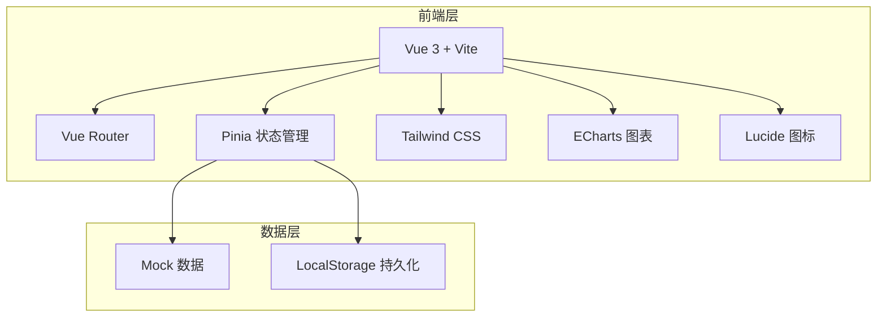
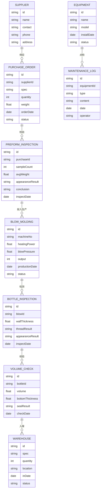

## 1. 架构设计



## 2. 技术选型

- **前端框架**：Vue 3 + TypeScript + Vite
- **路由管理**：Vue Router 4
- **状态管理**：Pinia
- **UI 样式**：Tailwind CSS 3
- **图表库**：ECharts 5
- **图标库**：Lucide Vue
- **数据方案**：Mock 数据 + LocalStorage 模拟持久化

## 3. 路由定义

| 路由路径 | 页面名称 | 说明 |
|----------|----------|------|
| /dashboard | 工作台 | 数据看板、待办事项 |
| /preform-purchase | 瓶坯采购 | 采购管理、供应商管理 |
| /preform-inspection | 瓶坯检验 | 来料质检、重量抽检 |
| /blow-molding | 加热吹瓶 | 生产过程、参数记录 |
| /bottle-inspection | 瓶身检测 | 壁厚测量、螺纹检查 |
| /volume-verification | 容量校验 | 容量测试、瓶底厚度 |
| /warehousing | 装箱入库 | 装箱管理、库存查询 |
| /equipment-check | 设备点检 | 点检记录、模具保养 |

## 4. 数据模型

### 4.1 数据模型定义



### 4.2 数据状态

所有数据通过 Mock 生成，使用 Pinia 管理全局状态，支持 LocalStorage 持久化保存用户操作数据。

## 5. 项目结构

```
src/
├── assets/          # 静态资源
├── components/      # 公共组件
│   ├── Layout/      # 布局组件
│   ├── Chart/       # 图表组件
│   └── Table/       # 表格组件
├── composables/     # 组合式函数
├── pages/           # 页面组件
│   ├── Dashboard/
│   ├── PreformPurchase/
│   ├── PreformInspection/
│   ├── BlowMolding/
│   ├── BottleInspection/
│   ├── VolumeVerification/
│   ├── Warehousing/
│   └── EquipmentCheck/
├── router/          # 路由配置
├── stores/          # Pinia 状态管理
├── mock/            # Mock 数据
├── types/           # TypeScript 类型定义
└── utils/           # 工具函数
```
